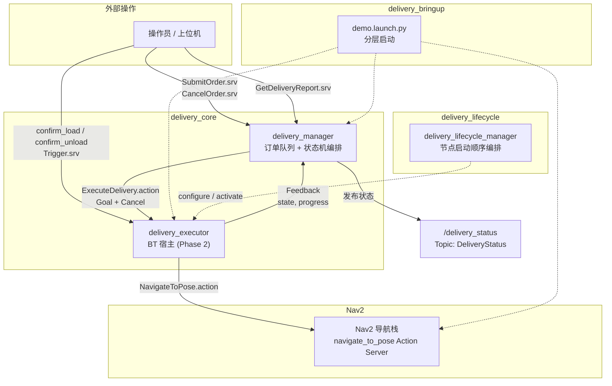
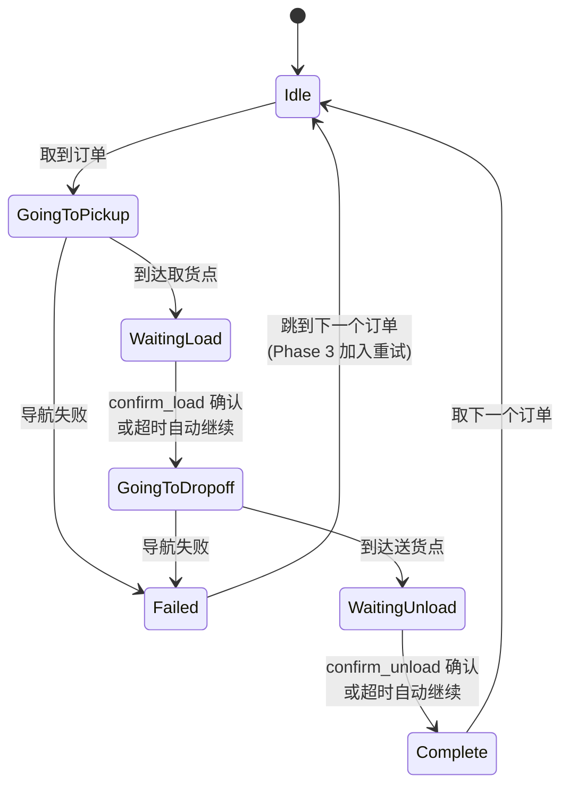
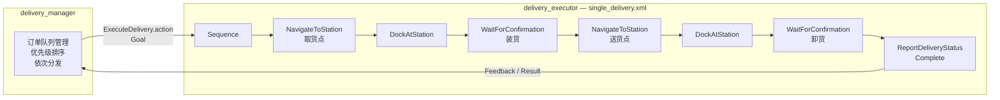

# ros2_delivery_robot

室内多点配送机器人系统。基于 ROS2 Jazzy + Nav2 + BehaviorTree.CPP 构建，在 Gazebo Harmonic 仿真环境中运行。

机器人接收配送订单后，自主导航至取货站点等待装货确认，再导航至送货站点等待卸货确认。支持多订单优先级队列、导航失败重试、生命周期管理。

## 目录

- [典型应用场景](#典型应用场景)
- [技术栈](#技术栈)
- [系统架构](#系统架构)
  - [包结构](#包结构)
  - [节点与通信拓扑](#节点与通信拓扑)
  - [配送状态机](#配送状态机)
  - [自定义接口](#自定义接口)
  - [行为树架构](#行为树架构-phase-2)
  - [生命周期管理](#生命周期管理)
- [构建与运行](#构建与运行)
- [站点配置](#站点配置)
- [设计决策](#设计决策)
- [开发进度](#开发进度)

## 典型应用场景

- 仓库内部物料配送（工位间转运零件）
- 医院药品/样本配送（药房 → 病房）
- 办公楼文件/快递配送（前台 → 工位）

## 技术栈

| 项 | 选型 |
|---|---|
| OS | Ubuntu 24.04 |
| ROS | ROS2 Jazzy |
| 仿真 | Gazebo Harmonic |
| 机器人 | TurtleBot3 Waffle Pi |
| 导航 | Nav2 |
| 行为树 | BehaviorTree.CPP v4 |
| 构建 | colcon / ament_cmake |

## 系统架构

### 包结构

```
ros2_ws/src/
├── delivery_interfaces/    消息/服务/动作定义
├── delivery_core/          C++ 核心节点（订单管理 + 导航编排 + BT 节点）
├── delivery_lifecycle/     生命周期管理器
├── delivery_simulation/    Gazebo 仿真资源（world、地图、RViz 配置）
└── delivery_bringup/       Launch 文件 + 配置文件
```

### 节点与通信拓扑



### 配送状态机

单个订单的生命周期：



### 自定义接口

**消息 (msg)**

| 消息 | 字段 | 说明 |
|---|---|---|
| `DeliveryOrder` | order_id, pickup_station, dropoff_station, priority | 配送订单描述 |
| `DeliveryStatus` | order_id, state, current_station, progress, error_msg | 配送实时状态 |
| `StationInfo` | station_id, x, y, yaw, station_type | 站点坐标与类型 |

**服务 (srv)**

| 服务 | 说明 |
|---|---|
| `SubmitOrder` | 提交配送订单到队列 |
| `CancelOrder` | 取消队列中的订单 |
| `GetDeliveryReport` | 获取所有已完成订单的状态报告 |

**动作 (action)**

| 动作 | 说明 |
|---|---|
| `ExecuteDelivery` | 执行单次配送，支持进度反馈和取消 |

### 行为树架构 (Phase 2)

BT 负责单次配送内的决策流程，状态机负责订单级别的队列管理：



### 生命周期管理

`delivery_lifecycle_manager` 编排节点启动顺序，确保依赖就绪后再激活下游：


## 构建与运行

```bash
# 环境准备
source /opt/ros/jazzy/setup.bash
export TURTLEBOT3_MODEL=waffle_pi

# 构建
cd ros2_ws
colcon build --symlink-install
source install/setup.bash

# 一键启动
ros2 launch delivery_bringup demo.launch.py

# 提交订单
ros2 service call /submit_order delivery_interfaces/srv/SubmitOrder \
  "{order: {order_id: 'order_001', pickup_station: 'station_A', dropoff_station: 'station_C', priority: 0}}"

# 观察状态流转
ros2 topic echo /delivery_status

# 模拟人工装货确认
ros2 service call /confirm_load std_srvs/srv/Trigger

# 模拟人工卸货确认
ros2 service call /confirm_unload std_srvs/srv/Trigger

# 查询配送报告
ros2 service call /get_delivery_report delivery_interfaces/srv/GetDeliveryReport
```

## 站点配置

站点在 `delivery_bringup/config/stations.yaml` 中定义：

```yaml
stations:
  - station_id: "station_A"
    x: 1.5
    y: 0.5
    yaw: 0.0
    station_type: 0   # pickup
  - station_id: "station_C"
    x: -0.5
    y: -1.5
    yaw: 3.14
    station_type: 1   # dropoff
  - station_id: "charge_home"
    x: 0.0
    y: 0.0
    yaw: 0.0
    station_type: 2   # charge
```

站点类型：0 = 取货点，1 = 送货点，2 = 充电点。

## 设计决策

**为什么用"等待确认"而不是 mock 机械臂？** 真实配送机器人（Keenon、普渡科技）到站后就是等待人工装卸，不涉及机械臂操作。等待确认模式比模拟一个不存在的机械臂更贴近真实产品。

**为什么 BT + 状态机混合而不是纯 BT？** 行为树擅长编排单次配送内的决策流程（导航、停靠、等待、重试），状态机擅长管理订单队列级别的状态流转。各取所长。

**为什么用 Action 而不是 Service 驱动配送执行？** 配送是长时间任务（分钟级），需要进度反馈和取消能力，这正是 ROS2 Action 的设计目的。Service 适合快速请求-响应。

## 开发进度

- [x] Phase 1：骨架 + 单点导航（delivery_manager 订单队列 + Nav2 导航 + 确认等待）
- [ ] Phase 2：行为树 + 停靠确认（BT 叶节点 + delivery_executor + Action 集成）
- [ ] Phase 3：多订单 + 生命周期 + 工程化（Fallback 重试 + CheckBattery + 定制场景 + 测试）

详见 [plan/](plan/) 目录。

## License

Apache-2.0
