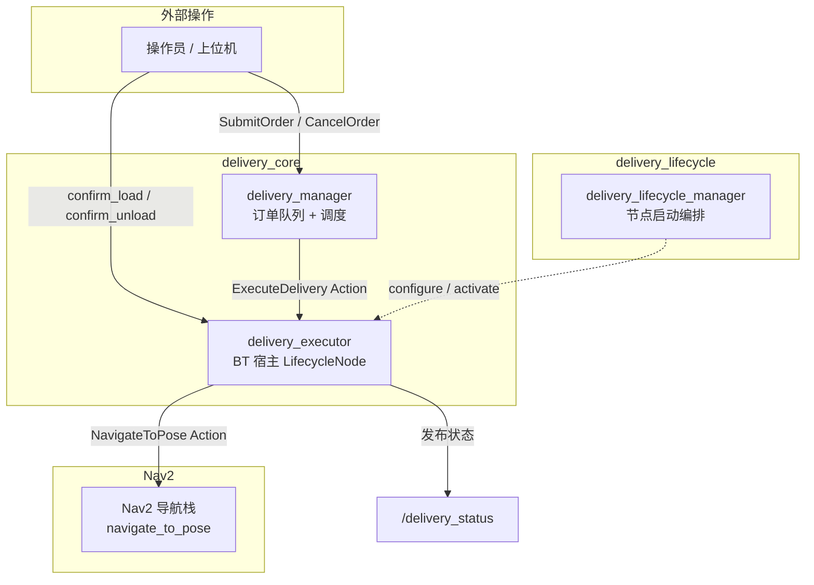
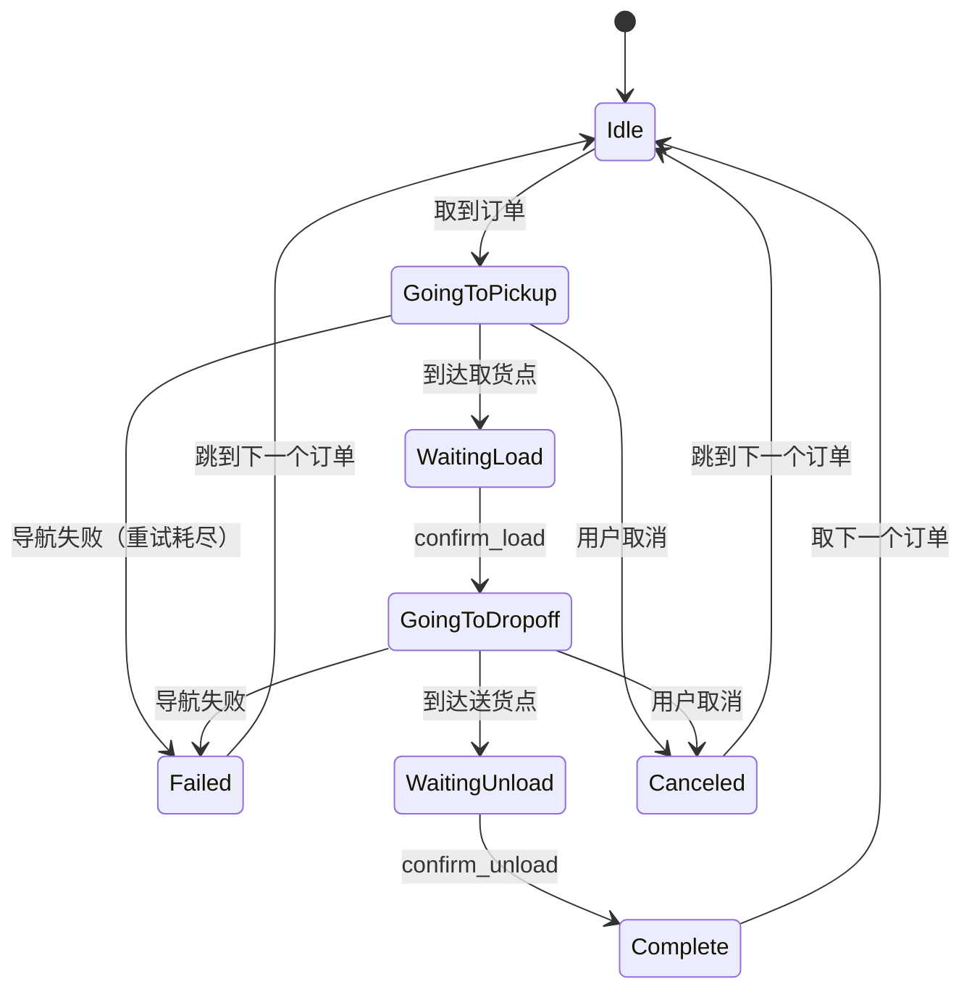

# ROS2 室内配送机器人

基于 ROS2 Jazzy 的室内多点配送机器人系统——接收配送订单，自主导航至取货点等待装货确认，再导航至送货点等待卸货确认，支持多订单队列、优先级调度和失败重试。

## 目录

- [典型应用场景](#典型应用场景)
- [技术栈](#技术栈)
- [系统架构](#系统架构)
  - [包结构](#包结构)
  - [节点与通信拓扑](#节点与通信拓扑)
  - [配送状态机](#配送状态机)
  - [自定义接口](#自定义接口)
  - [行为树架构](#行为树架构)
  - [生命周期管理](#生命周期管理)
- [构建与运行](#构建与运行)
- [站点配置](#站点配置)
- [设计决策](#设计决策)
- [开发进度](#开发进度)

## 典型应用场景

- 仓库内部物料配送（工位间转运零件）
- 医院药品/样本配送（药房 → 病房）
- 办公楼文件/快递配送（前台 → 工位）

## 技术栈

| 项 | 选型 |
|---|---|
| OS | Ubuntu 24.04 |
| ROS | ROS2 Jazzy |
| 仿真 | Gazebo Harmonic |
| 机器人 | TurtleBot3 Waffle Pi |
| 导航 | Nav2 |
| 行为树 | BehaviorTree.CPP v4 |
| 构建 | colcon / ament_cmake |

## 系统架构

### 包结构

```
ros2_ws/src/
├── delivery_interfaces/    消息/服务/动作定义
├── delivery_core/          C++ 核心节点（订单管理 + 导航编排 + BT 节点）
├── delivery_lifecycle/     生命周期管理器
├── delivery_simulation/    备用 warehouse 场景资源（当前仿真使用 TurtleBot3 标准环境）
└── delivery_bringup/       Launch 文件 + 配置文件
```

### 节点与通信拓扑



### 配送状态机



### 自定义接口

**消息 (msg)**

| 消息 | 字段 | 说明 |
|---|---|---|
| `DeliveryOrder` | order_id, pickup_station, dropoff_station, priority | 配送订单描述 |
| `DeliveryStatus` | order_id, state, current_station, progress, error_msg | 配送实时状态（含 STATE_CANCELED） |
| `StationInfo` | station_id, x, y, yaw, station_type | 站点坐标与类型 |

**服务 (srv)**

| 服务 | 说明 |
|---|---|
| `SubmitOrder` | 提交配送订单到队列 |
| `CancelOrder` | 取消队列中或执行中的订单（验证 order_id） |
| `GetDeliveryReport` | 获取所有订单状态报告（含当前执行中） |

**动作 (action)**

| 动作 | 说明 |
|---|---|
| `ExecuteDelivery` | 执行单次配送，支持进度反馈和取消 |

### 行为树架构

BT 负责单次配送内的决策流程。支持三种 XML 配置：

| XML 文件 | 特点 |
|---|---|
| `single_delivery.xml` | 基础版：无重试 |
| `single_delivery_robust.xml` | 带重试：RetryNode(2) 包裹导航 |
| `delivery_mission.xml` | 完整版：电量检查 + 充电 + SubTree 引用 |

```
Sequence
├── Fallback (电量检查)
│   ├── CheckBattery threshold=20%
│   └── Sequence (充电)
│       ├── NavigateToStation → charge_home
│       └── ReportDeliveryStatus
├── RetryNode(2)
│   └── NavigateToStation → pickup_station
├── DockAtStation
├── WaitForConfirmation → load
├── RetryNode(2)
│   └── NavigateToStation → dropoff_station
├── DockAtStation
├── WaitForConfirmation → unload
└── ReportDeliveryStatus → complete
```

### 生命周期管理

`delivery_executor` 为 LifecycleNode，由 `delivery_lifecycle_manager` 管理：

```
Unconfigured → on_configure (加载站点、注册 BT) → Inactive
Inactive → on_activate (创建 Action Server) → Active
Active → on_deactivate (停止 BT) → Inactive
```

## 构建与运行

```bash
# 环境准备
source /opt/ros/jazzy/setup.bash
export TURTLEBOT3_MODEL=waffle_pi

# 构建
cd ros2_ws
colcon build --symlink-install
source install/setup.bash

# 一键启动
ros2 launch delivery_bringup demo.launch.py

# 提交订单
ros2 service call /submit_order delivery_interfaces/srv/SubmitOrder \
  "{order: {order_id: 'order_001', pickup_station: 'station_A', dropoff_station: 'station_C', priority: 0}}"

# 观察状态
ros2 topic echo /delivery_status

# 人工确认
ros2 service call /confirm_load std_srvs/srv/Trigger
ros2 service call /confirm_unload std_srvs/srv/Trigger

# 配送报告
ros2 service call /get_delivery_report delivery_interfaces/srv/GetDeliveryReport
```

### 运行测试

```bash
cd ros2_ws
colcon build --symlink-install
colcon test --packages-select delivery_core
colcon test-result --verbose
```

## 站点配置

站点在 `delivery_bringup/config/stations.yaml` 中定义：

```yaml
stations:
  - station_id: "station_A"
    x: 3.0
    y: 2.0
    yaw: 0.0
    station_type: 0   # pickup
  - station_id: "station_C"
    x: -3.0
    y: -2.0
    yaw: 3.14
    station_type: 1   # dropoff
  - station_id: "charge_home"
    x: 0.0
    y: 0.0
    yaw: 0.0
    station_type: 2   # charge
```

站点类型：0 = 取货点，1 = 送货点，2 = 充电点。

## 设计决策

- **双节点架构**：manager 负责调度，executor 负责执行，通过 Action 解耦
- **BT + 状态机混合**：BT 编排单次配送决策，状态机管理订单队列
- **LifecycleNode**：executor 使用生命周期管理，确保有序启动
- **RetryNode 重试**：导航失败自动重试，无需修改业务逻辑
- **模拟电池**：每次配送扣减电量，低电量时导航至充电点待机（demo 级别，不恢复电量）

## 开发进度

- [x] Phase 1：骨架 + 单点导航
- [x] Phase 2：行为树 + 停靠确认
- [x] Phase 3：多订单 + 生命周期 + 工程化

> 核心功能骨架已实现。电量充电流程为 demo 级别，仿真使用 TurtleBot3 标准环境。

详见 [plan/](plan/) 目录。

## License

Apache-2.0
