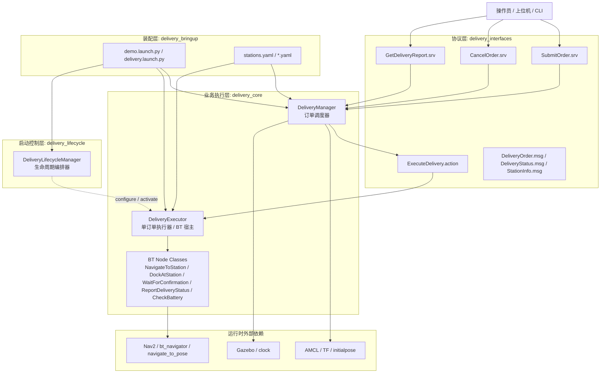
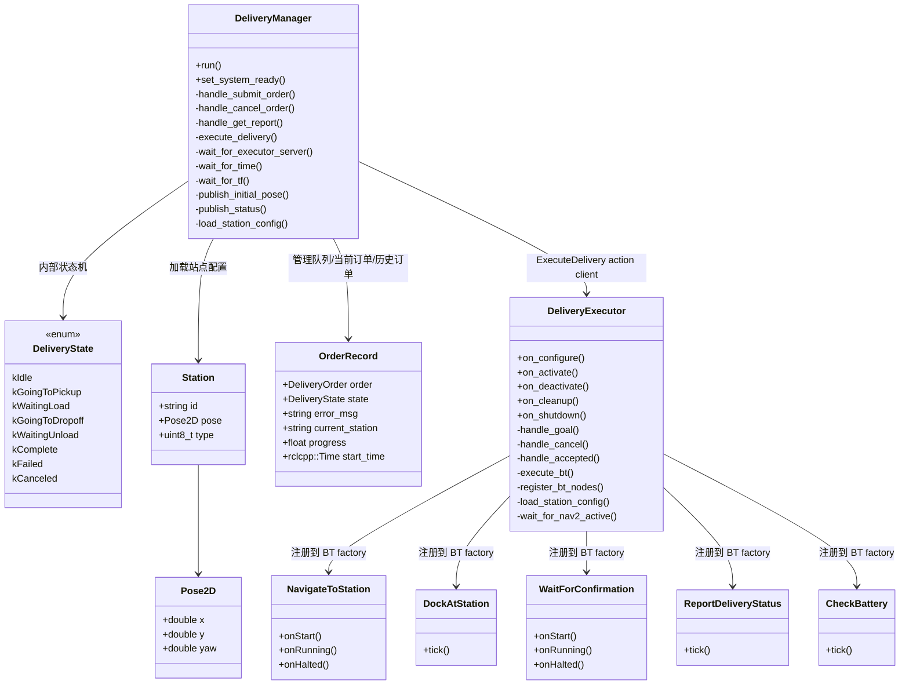
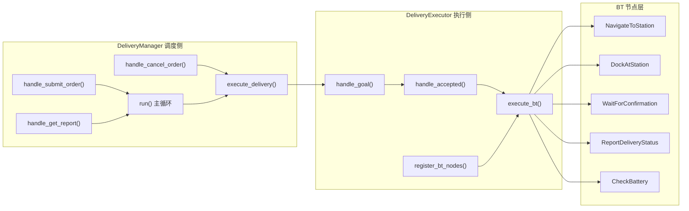
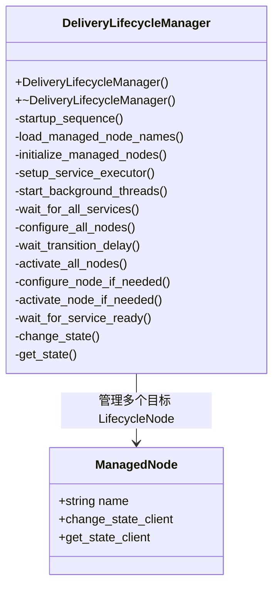
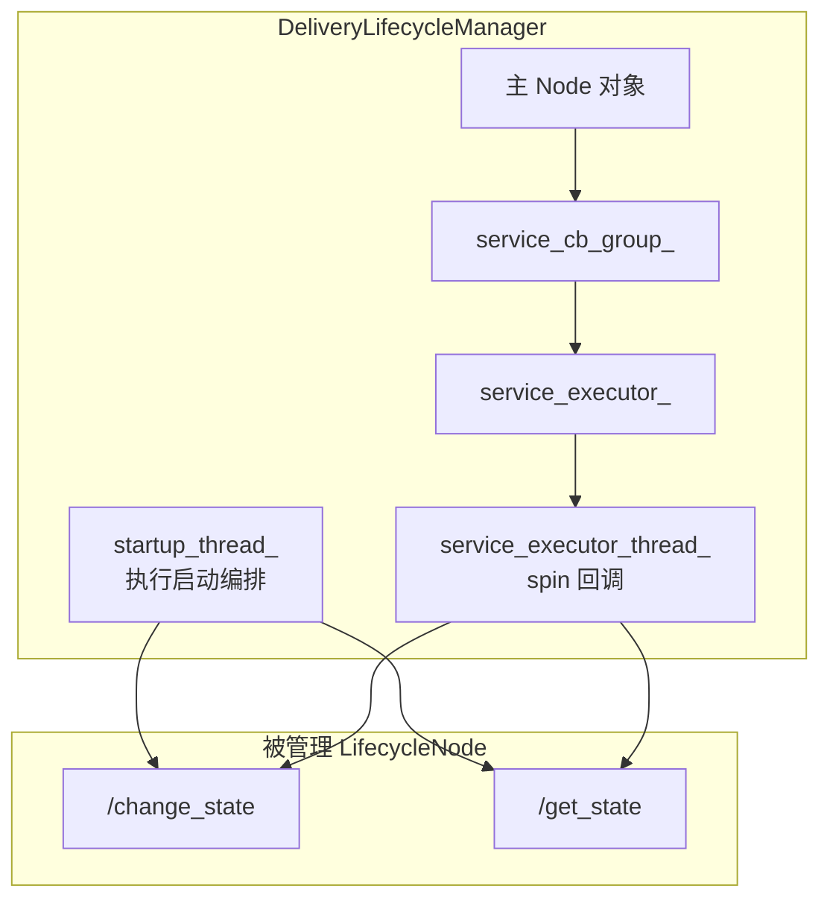
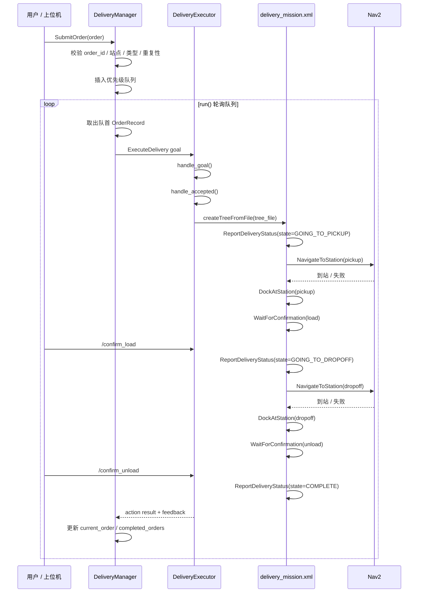
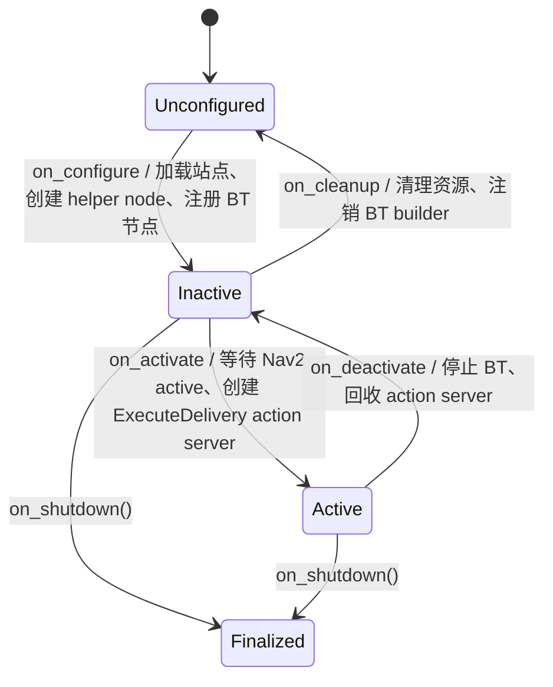
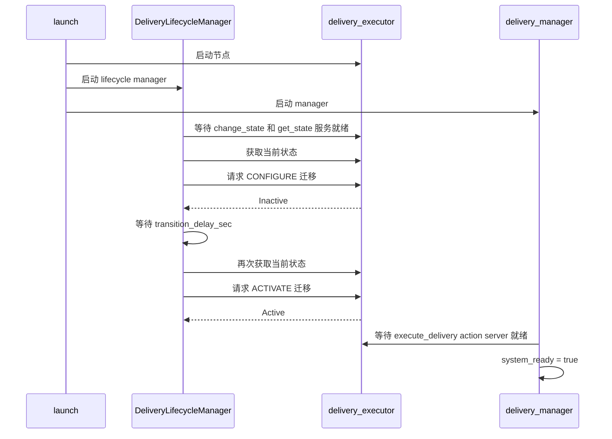

# 架构说明

本文承接 `README.md` 中不适合放在首页的实现级内容，重点说明当前代码中的类级架构、线程模型和运行时序。  
首页仍以项目入口、默认运行方式和稳定概览为主。

## 运行链路总览

从实现上看，这个项目不是单一节点，而是一个分层的配送业务系统：

- `delivery_interfaces` 定义协议层，统一订单、状态、站点、服务和动作接口。
- `delivery_core` 定义业务执行层，负责接单调度、单单执行、行为树叶节点。
- `delivery_lifecycle` 定义系统启动控制层，负责把 `delivery_executor` 推进到可工作状态。
- `delivery_bringup` 定义装配层，负责 launch、参数和默认行为树选择。
- `delivery_simulation` 定义仿真资源层，提供 Gazebo world、地图和场景资源。

## delivery_core 架构

`delivery_core` 是真正的业务核心。它不是一个“大节点”，而是由调度器、执行器、行为树节点和少量入口文件拼起来的。

### 类关系

### 关键职责

| 类 / 结构 | 文件 | 层级 | 职责 |
|---|---|---|---|
| `DeliveryManager` | `delivery_manager.hpp/.cpp` | 调度层 | 对外提供接单、取消、报告服务；维护优先级队列；等待系统依赖就绪；把单个订单委托给 executor；汇总 action feedback 为全局订单视图。 |
| `DeliveryManager::DeliveryState` | `delivery_manager.hpp` | 内部状态模型 | manager 内部使用的订单状态枚举，与消息常量解耦，便于业务代码表达流程语义。 |
| `DeliveryManager::Pose2D` | `delivery_manager.hpp` | 内部数据结构 | 表示站点二维位姿。 |
| `DeliveryManager::Station` | `delivery_manager.hpp` | 内部数据结构 | 表示从 YAML 读出的站点定义，供订单校验和导航目标解析。 |
| `DeliveryManager::OrderRecord` | `delivery_manager.hpp` | 内部数据结构 | 表示订单运行时快照，贯穿待执行、执行中和历史记录。 |
| `DeliveryExecutor` | `delivery_executor.hpp/.cpp` | 执行层 | `LifecycleNode`；加载站点配置；注册 BT 节点；等待 Nav2 ready；提供 `ExecuteDelivery` action server；为每个订单创建并运行独立行为树。 |
| `NavigateToStation` | `nodes/navigate_to_station.hpp/.cpp` | BT 叶节点 | 从黑板读取 `station_id` 和站点表，转成 Nav2 `navigate_to_pose` 目标；异步等待导航结果；被 halt 时主动取消导航。 |
| `DockAtStation` | `nodes/dock_at_station.hpp/.cpp` | BT 叶节点 | 发布一小段低速 `cmd_vel`，模拟站点前的最后微调停靠。 |
| `WaitForConfirmation` | `nodes/wait_for_confirmation.hpp/.cpp` | BT 叶节点 | 等待 `/confirm_load` 或 `/confirm_unload` 服务置位的原子标志，并做超时控制。 |
| `ReportDeliveryStatus` | `nodes/report_delivery_status.hpp/.cpp` | BT 叶节点 | 发布 `DeliveryStatus`，并把状态、站点、进度写回黑板，供 executor 读取并转成 action feedback。 |
| `CheckBattery` | `nodes/check_battery.hpp/.cpp` | BT 条件节点 | 从黑板读取当前电量，判断是否满足阈值。 |

### 非类入口文件

| 文件 | 作用 |
|---|---|
| `src/delivery_manager_main.cpp` | 创建 `DeliveryManager`，用多线程 executor 处理 ROS 回调，主线程运行 `DeliveryManager::run()`。 |
| `src/delivery_executor_main.cpp` | 启动 `DeliveryExecutor` 生命周期节点。 |

### 内部分层

### 状态边界

- `DeliveryManager` 只拥有订单级状态，例如队列、当前订单、历史订单、取消句柄。
- `DeliveryExecutor` 只拥有单任务执行状态，例如 `goal_inflight_`、`active_goal_handle_`、BT 线程、确认标志、电量。
- `ReportDeliveryStatus` 是这两个类之间的桥：BT 先写黑板和状态话题，executor 再转成 action feedback，manager 再同步回自己的 `OrderRecord`。

## delivery_lifecycle 架构

`delivery_lifecycle` 目前只有一个核心类，但它承担的是“系统什么时候算 ready”的职责，而不是业务本身。

这里的“系统”在当前仓库里主要指：把 `delivery_executor` 从 `Unconfigured` 推进到 `Active`，而不是统一管理整个 demo 中的所有节点。

### 类关系

### 关键职责

| 类 / 结构 | 文件 | 层级 | 职责 |
|---|---|---|---|
| `DeliveryLifecycleManager` | `delivery_lifecycle_manager.hpp/.cpp` | 启动控制层 | 读取 `managed_nodes` 参数；为每个被管理节点创建 `change_state` / `get_state` 客户端；在后台线程中按顺序等待服务、configure、延时、activate。 |
| `DeliveryLifecycleManager::ManagedNode` | `delivery_lifecycle_manager.hpp` | 内部数据结构 | 描述一个被生命周期管理器控制的目标节点及其两个标准 lifecycle 服务客户端。 |

### 线程与回调模型

这里的关键点不是“有两个线程”，而是：

- `startup_thread_` 用同步风格写启动编排逻辑，代码清晰。
- `service_executor_thread_` 专门负责处理服务响应，避免 `future.wait_for()` 把自己等待的回调堵死。

## 默认订单执行时序

下面这张图对应默认 demo 路径，也就是 `delivery.launch.py` 默认加载 `delivery_mission.xml` 时的一笔订单执行过程。

注意：

- 默认树是 `delivery_mission.xml`，包含 `CheckBattery` 前置检查 + `SingleDelivery` 子树
- 电量不足时 `CheckBattery` 直接返回 FAILURE，executor 中止配送
- 如需跳过电量检查，可通过 launch 参数 `tree_file` 指定 `single_delivery_robust.xml`

## 生命周期与启动时序

`delivery_executor` 为 `LifecycleNode`，由 `delivery_lifecycle_manager` 管理：

`delivery_lifecycle_manager` 的启动流程如下：

## 默认配置与可选实现差异

文档最容易漂移的地方主要有两类，这里集中说明：

### 默认 demo 行为

- `delivery.launch.py` 默认加载 `delivery_mission.xml`（含 CheckBattery + 导航重试）
- 默认路径包含电量前置检查和导航失败自动重试
- 首页文档应默认描述这一条主链路

### 可选能力

- `single_delivery_robust.xml` 是不含电量检查的子树，可通过 launch 参数 `tree_file` 切换
- `CheckBattery` 已实现并注册到 BT factory，默认 demo 链路中已生效
- 如果未来默认树切换，README 和本文都应同步更新”默认路径”描述
